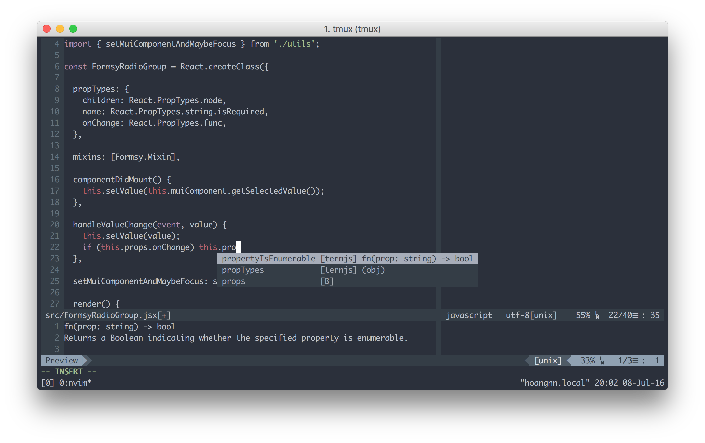

# Modern Neovim & Dotfiles Setup for macOS

A modern, high-performance configuration for **Neovim**, **Zsh**, and **Tmux**, tailored for JavaScript/TypeScript developers on macOS.



## Features

### 🚀 Modern Neovim
*   **Hybrid Configuration**: Robust `vimrc` core with modern Lua modules.
*   **Native LSP**: Full IDE features (Go to Definition, Hover, Refactor) via `mason.nvim` & `nvim-lspconfig`.
*   **Intelligent Completion**: `nvim-cmp` with LuaSnip for snippet support.
*   **TreeSitter**: Advanced AST-based syntax highlighting and indentation.
*   **Fuzzy Finding**: `Telescope` for lightning-fast file, text, and buffer search.
*   **Git Integration**: `gitsigns.nvim` for diffs and `lazygit` integration.
*   **Key Hints**: `which-key.nvim` popup ensures you never forget a keybinding.

### ⚡ Optimized Zsh
*   **Performance**: NVM lazy-loading (~300ms faster startup).
*   **Theme**: Powerlevel10k with instant prompt and git status.
*   **Productivity**: Autosuggestions, syntax highlighting, and `fzf` history search.

### 🖥️ Power Tmux
*   **Workflow**: Vim-style navigation (`h`, `j`, `k`, `l`) and copy mode.
*   **Visuals**: TrueColor (24-bit), undercurl support, and status line integration.
*   **Persistence**: Auto-save and restore sessions via `tmux-resurrect`.

---

## Prerequisites

*   **macOS** (Optimized for Apple Silicon/Intel Macs)
*   **iTerm2** (Recommended for proper font/color support)
*   **Nerd Font** (Required for icons, e.g., [MesloLGS NF](https://github.com/romkatv/powerlevel10k#meslo-nerd-font-patched-for-powerlevel10k))

## Installation

1.  **Clone the repository**:
    ```bash
    git clone https://github.com/codeaholicguy/dotfiles.git
    cd dotfiles
    ```

2.  **Run the install script**:
    This handles Homebrew, Zsh, Neovim, Tmux, and symlinking.
    ```bash
    chmod +x install.sh
    ./install.sh --macos
    ```

3.  **Install Neovim Plugins**:
    Open Neovim and install the plugins managed by `vim-plug`.
    ```bash
    nvim
    :PlugInstall
    ```
    *Restart Neovim after installation to load Lua configurations.*

4.  **Install Language Servers**:
    LSP servers are managed via Mason.
    ```vim
    :MasonInstall tsserver html cssls jsonls
    ```

## Quick Start Guide

### Keybindings Cheat Sheet

**Leader Key**: `Space`

| Action | Mapping | Mnemonic |
|--------|---------|----------|
| **File Navigation** | | |
| Find Files | `<Leader>ff` or `` ` `` | **F**ind **F**iles |
| Find Text (Grep) | `<Leader>fg` or `\` | **F**ind **G**rep |
| File Tree | `Ctrl-\` | Toggle NERDTree |
| Recent Buffers | `<Leader>fb` | **F**ind **B**uffers |
| **Code Intelligence** | | |
| Go to Definition | `gd` | **G**o **D**efinition |
| Hover Documentation | `K` | Like `man` pages |
| Rename Symbol | `<Leader>rn` | **R**e**n**ame |
| Code Actions | `<Leader>ca` | **C**ode **A**ction |
| Format Code | `<Leader>f` | **F**ormat |
| **Git** | | |
| LazyGit Interface | `<Leader>gg` | **G**it **G**ui |
| Next Hunk | `]c` | |
| Prev Hunk | `[c` | |
| **Window/Buffer** | | |
| Switch Window | `Ctrl-h/j/k/l` | Vim directions |
| Close Buffer | `<Leader>bd` | **B**uffer **D**elete |
| Next Buffer | `TAB` or `L` | |
| Prev Buffer | `Shift-TAB` or `H` | |

### Tmux Basics
*   **Prefix**: `Ctrl-Space` (Remapped from `Ctrl-b` for ergonomics)
*   **Split Vertical**: `Prefix + |`
*   **Split Horizontal**: `Prefix + -`
*   **Navigate Panes**: `Prefix + h/j/k/l`

## Configuration Structure

The configuration is modular to allow easy maintenance and upgrades.

```text
~/dotfiles/
├── vimrc                  # Core Vim/Neovim settings (options, mappings)
├── vimrc.bundles          # Plugin list (vim-plug)
├── vim/
│   └── lua/               # Lua modules for modern Neovim plugins
│       ├── lsp-config.lua        # Native LSP & Mason setup
│       ├── treesitter-config.lua # Syntax highlighting
│       ├── completion.lua        # nvim-cmp & snippets
│       ├── telescope-config.lua  # Fuzzy finder setup
│       └── ... (gitsigns, bufferline, whichkey)
├── zshrc                  # Zsh configuration
└── tmux.conf              # Tmux configuration
```

## Customization

*   **Adding Vim Plugins**: Edit `vimrc.bundles` and add `Plug 'username/repo'`, then run `:PlugInstall`.
*   **Modifying LSP**: Edit `vim/lua/lsp-config.lua` to add new language servers or change attach logic.
*   **Shell Aliases**: Add your custom aliases to `zshrc`.

## Credits

Thanks to the community and authors of these amazing tools:
*   [vim-plug](https://github.com/junegunn/vim-plug)
*   [Dracula Theme](https://github.com/dracula/dracula-theme)
*   [Oh My Zsh](https://github.com/ohmyzsh/ohmyzsh)
*   [Powerlevel10k](https://github.com/romkatv/powerlevel10k)
